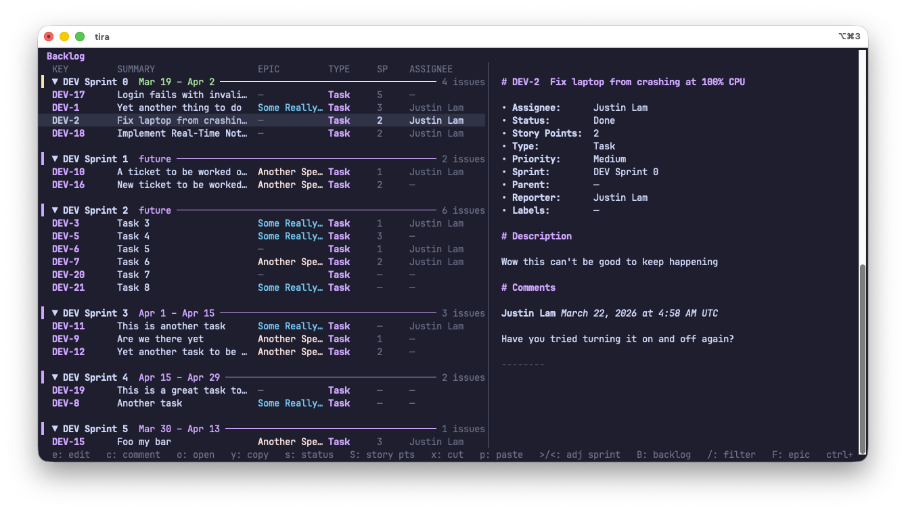
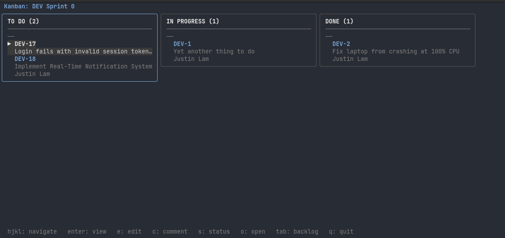

# tira


A blazing fast terminal interface for Jira, written in Go. It provides a fast, extensible interface to managing issues, sprints, and boards.

> 
> <sub>Backlog view with persistent issue sidebar.</sub>

> 
> <sub>Kanban view.</sub>

## Features

- **Interactive TUI**: Split-view backlog and kanban board with fuzzy search, multi-select, and drag-and-drop-like operations with vim-inspired keybindings
- **View and edit issues**: Full issue detail view with comments, edit via `$EDITOR` or in-TUI form
- **Create issues**: New issues via markdown template in your editor
- **Multiple profiles**: Switch between Jira instances or accounts with `--profile`
- **Fast and stateless**: No local database; auth via config file

## Getting Started

### Prerequisites

- Go 1.25+
- A Jira Cloud account with API access
- Clipboard support (optional, for copying URLs):
  - **macOS**: `pbcopy` (built-in)
  - **Linux**: `xclip` (e.g. `sudo apt install xclip`)

### Installation

With curl:

```sh
curl -fsSL https://raw.githubusercontent.com/justinmklam/tira/main/bin/install.sh | bash
```

Or with go:

```sh
go install github.com/justinmklam/tira@latest
```

### Configuration

Create `~/.config/tira/config.yaml` and add a default profile:

```yaml
profiles:
  default:
    jira_url: https://yourorg.atlassian.net
    email: you@example.com
    token: your_api_token_here
    project: MYPROJ
    board_id: 42
    classic_project: true   # Set to true for company-managed (classic) projects
```

**Required fields:**

- `jira_url` — Your Jira Cloud instance URL
- `email` — Your Jira Cloud email address
- `token` — Your Jira API token (generate from <https://id.atlassian.com/manage-profile/security/api-tokens>)
- `project` — Default project key
- `board_id` — Required for `board`/`backlog`/`kanban` commands

**Optional fields:**

- `classic_project` — Affects browser URL construction only

See [Configuration](docs/configuration.md) for details.

### Usage

#### Board TUI

Launch the interactive board TUI:

```sh
# Start in backlog view
tira backlog

# Start in kanban view
tira kanban
```

**Common keybindings:**

| Key | Action |
|-----|--------|
| `Tab` | Toggle between backlog and kanban |
| `j`/`k` | Move down/up |
| `Enter` | Open issue detail / Toggle sprint collapse |
| `e` | Edit issue (in-TUI form) |
| `c` | Add comment |
| `/` | Filter issues |
| `Space` | Select issue |
| `v` | Visual mode (extend selection) |
| `x` / `p` | Cut / Paste issues |
| `s` | Change status |
| `A` | Set assignee |
| `S` | Set story points |
| `R` | Refresh from Jira |
| `?` | Show help |
| `q` | Quit |

See [Keybindings](docs/keybindings-backlog.md) for the complete reference.

#### CLI Commands

**View an issue:**

```sh
tira get MP-101
```

**Edit an issue in your editor:**

```sh
tira get MP-101 --edit
```

**Create a new issue:**

```sh
# Interactive with defaults
tira create

# Specify project and type
tira create --project DEV --type Bug
```

**Use a specific profile:**

```sh
tira --profile dev get DEV-101
tira --profile dev board
```

## Documentation

| Document | Description |
|----------|-------------|
| [Architecture](docs/architecture.md) | System architecture and package structure |
| [CLI Commands](docs/cli-commands.md) | Detailed CLI command documentation |
| [Configuration](docs/configuration.md) | Configuration system details |
| [TUI Architecture](docs/tui-architecture.md) | TUI model architecture |
| [API Client](docs/api-client.md) | API client implementation |
| [Keybindings](docs/keybindings-backlog.md) | Complete keybinding reference |
| [Glossary](docs/glossary.md) | Glossary and key types |

## Build & Development

Clone the repository and build the CLI:

```sh
make check        # Run all checks (fmt, vet, lint, test)
make build        # Compile the binary
make run          # Run the tui using your default profile
```

For development, a second `dev` profile can be added to your `~/.config/tira.yaml`:

```yaml
profiles:
  ...
  dev:
    jira_url: https://dev-domain.atlassian.net
    email: dev@example.com
    token: dev_token_here
    project: DEVPROJ
    board_id: 43
```

Other commands:

```sh
make run-dev      # Run the tui using your dev profile, with debug enabled
make test         # Run all tests
make test-race    # Run tests with race detector
make fmt          # Format code in-place
make vet          # Run go vet
make lint         # Run golangci-lint (requires golangci-lint installation)
```

Always run `make check` before pushing.

## Acknowledgements

This project was built with the excellent [bubbletea](https://github.com/charmbracelet/bubbletea) framework by [Charm](https://github.com/charmbracelet).

Inspiration for this tool was taken from:

- [lazygit](https://github.com/jesseduffield/lazygit)
- [gh-dash](https://github.com/dlvhdr/gh-dash)
- [k9s](https://github.com/derailed/k9s)
- [oxker](https://github.com/mrjackwills/oxker)

## License

MIT
