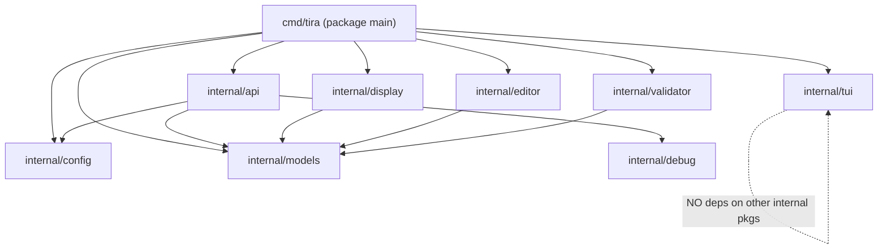
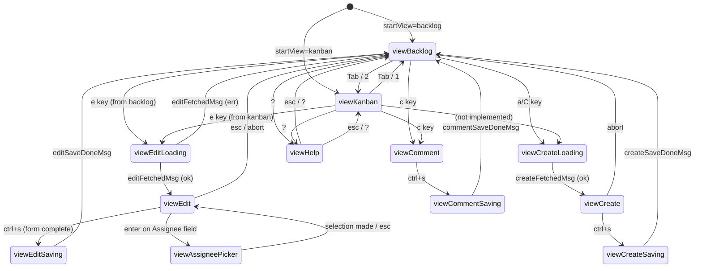
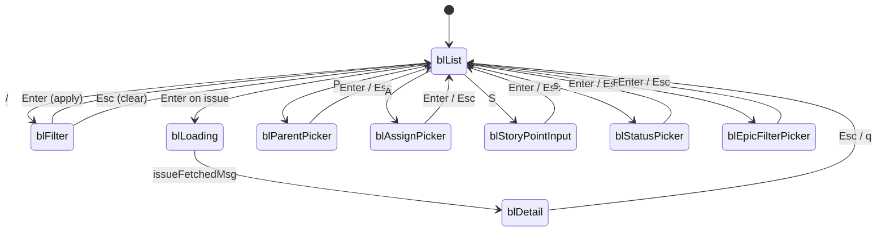

# tira — Comprehensive Codebase Knowledge Document

> Generated: 2026-03-20
> Repo: `github.com/justinmklam/tira`
> Go module: `github.com/justinmklam/tira`

---

## Table of Contents

1. [Project Overview](#1-project-overview)
2. [Tech Stack](#2-tech-stack)
3. [Repository Layout](#3-repository-layout)
4. [Package Dependency Graph](#4-package-dependency-graph)
5. [Configuration System](#5-configuration-system)
6. [CLI Commands](#6-cli-commands)
7. [Board TUI Architecture](#7-board-tui-architecture)
8. [Backlog View (blModel)](#8-backlog-view-blmodel)
9. [Kanban View (kanbanModel)](#9-kanban-view-kanbanmodel)
10. [In-TUI Edit and Create Flow (editModel)](#10-in-tui-edit-and-create-flow-editmodel)
11. [In-TUI Comment Flow (commentInputModel)](#11-in-tui-comment-flow-commentinputmodel)
12. [Editor Flow (get --edit / create)](#12-editor-flow-get---edit--create)
13. [API Client](#13-api-client)
14. [ADF (Atlassian Document Format)](#14-adf-atlassian-document-format)
15. [Shared TUI Infrastructure (internal/tui)](#15-shared-tui-infrastructure-internaltui)
16. [Data Models (internal/models)](#16-data-models-internalmodels)
17. [Display Package (internal/display)](#17-display-package-internaldisplay)
18. [Debug Package (internal/debug)](#18-debug-package-internaldebug)
19. [Keybinding Reference](#19-keybinding-reference)
20. [State Machines](#20-state-machines)
21. [Concurrency Patterns](#21-concurrency-patterns)
22. [Design Decisions and Gotchas](#22-design-decisions-and-gotchas)
23. [Glossary](#23-glossary)
24. [Key Types and Interfaces](#24-key-types-and-interfaces)

---

## 1. Project Overview

**tira** is a lazygit-style terminal UI for Jira Cloud, built in Go with the [Charm](https://charm.sh/) ecosystem (Bubbletea, Bubbles, Lipgloss, Glamour). It provides:

- An interactive split-view TUI (`board`/`backlog`/`kanban` commands) for browsing and managing a Jira board
- A CLI `get` command for fetching and displaying a single issue in a terminal pager
- A CLI `create` command for creating new issues via `$EDITOR` markdown templates
- A CLI `get --edit` mode for editing existing issues via the same template system

The application is stateless: authentication credentials are stored in a config file and each command authenticates from scratch.

---

## 2. Tech Stack

| Layer | Library/Tool |
|-------|-------------|
| CLI framework | `github.com/spf13/cobra` |
| Config loading | `github.com/spf13/viper` |
| TUI framework | `github.com/charmbracelet/bubbletea` |
| TUI components | `github.com/charmbracelet/bubbles` (spinner, viewport, textinput, textarea) |
| Styling | `github.com/charmbracelet/lipgloss` |
| Markdown rendering | `github.com/charmbracelet/glamour` |
| TUI forms | `github.com/charmbracelet/huh` |
| Jira API client (base) | `github.com/andygrunwald/go-jira/v2/cloud` |
| Fuzzy matching | `github.com/lithammer/fuzzysearch/fuzzy` |
| Clipboard | `github.com/atotto/clipboard` |
| Logging | `github.com/charmbracelet/log` |
| Language | Go 1.26 |

---

## 3. Repository Layout

```
tira/
├── cmd/tira/
│   ├── main.go              # Entry point → Execute()
│   ├── root.go              # Cobra root command, global flags, config loading
│   ├── get.go               # `get <key> [--edit]` command
│   ├── create.go            # `create` command
│   ├── board.go             # `board`/`backlog`/`kanban` commands + boardModel (top-level TUI)
│   ├── backlog.go           # blModel: backlog state + update logic
│   ├── backlog_view.go      # blModel: all View() rendering
│   ├── kanban.go            # kanbanModel: state + update + rendering
│   ├── editmodel.go         # editModel: in-TUI issue form (huh-like multi-field input)
│   └── commentmodel.go      # commentInputModel: in-TUI comment textarea
│
├── internal/
│   ├── api/
│   │   ├── client.go        # Client interface + jiraClient implementation
│   │   └── adf.go           # Atlassian Document Format → Markdown converter
│   ├── config/
│   │   └── config.go        # Config struct + Load(profileName) using viper
│   ├── models/
│   │   └── models.go        # Shared data types (no logic)
│   ├── tui/
│   │   ├── spinner.go       # Generic RunWithSpinner[T] for pre-TUI blocking ops
│   │   ├── styles.go        # Color constants, shared lipgloss styles, helper funcs
│   │   ├── helpers.go       # FixedWidth, Clamp, SplitPanes, OverlaySize, etc.
│   │   ├── picker.go        # PickerModel: reusable debounced search picker
│   │   └── help.go          # HelpModel: scrollable keybinding overlay
│   ├── display/
│   │   └── issue.go         # RenderIssue: Issue → Markdown string
│   ├── editor/
│   │   ├── template.go      # RenderTemplate + WriteTempFile
│   │   ├── parse.go         # ParseTemplate: template string → IssueFields
│   │   └── open.go          # OpenEditor: exec $EDITOR and block
│   ├── validator/
│   │   ├── validate.go      # Validate: IssueFields + ValidValues → []ValidationError
│   │   └── annotate.go      # AnnotateTemplate: inject error comments into template
│   └── debug/
│       └── logger.go        # File-based debug logger + HTTP transport wrapper
│
├── docs/
│   ├── architecture.md
│   ├── keybindings-backlog.md
│   ├── tira-plan.md
│   └── tira-tasks.md
├── config.example.yaml
├── go.mod
├── Makefile
└── CLAUDE.md
```

---

## 4. Package Dependency Graph



**Critical invariants:**
- `internal/tui` imports ONLY Charm libraries — never any other `internal/` package
- `internal/editor` and `internal/validator` are pure string/struct logic — no I/O, no TUI
- `internal/api` does not import `tui`, `display`, `editor`, or `validator`
- All TUI model code lives in `cmd/tira/` (package main)

---

## 5. Configuration System

### File: `internal/config/config.go`

**Config struct:**

```go
type Config struct {
    JiraURL        string `mapstructure:"jira_url"`
    Email          string `mapstructure:"email"`
    Token          string `mapstructure:"token"`
    Project        string `mapstructure:"project"`
    BoardID        int    `mapstructure:"board_id"`
    ClassicProject bool   `mapstructure:"classic_project"`
}
```

**Loading:** `config.Load(profileName string)` uses viper to read `~/.config/tira/config.yaml` (also checks current directory). Config is organized as named profiles under the `profiles:` key.

**Config file format** (`config.example.yaml`):
```yaml
profiles:
  default:
    jira_url: https://your-domain.atlassian.net
    email: your-email@example.com
    token: your-api-token
    project: MYPROJ
    board_id: 42
    classic_project: true   # for company-managed (classic) projects
  dev:
    jira_url: https://dev-domain.atlassian.net
    ...
```

**Required fields:** `jira_url`, `email`, `token` — missing any of these causes a fatal error at startup.
**Optional:** `project`, `board_id`, `classic_project`.

**Global flags** (root.go):
- `--profile <name>` (default: `"default"`) — selects which profile to use
- `--debug` — enables file-based debug logging to `./debug.log`

**The `cfg` global:** Config is loaded in `PersistentPreRunE` and stored in the package-level `var cfg *config.Config`. All commands access it as `cfg`.

---

## 6. CLI Commands

### 6.1 `tira get <key> [--edit]`

**File:** `cmd/tira/get.go`

**Without `--edit`:**
1. Creates API client from `cfg`
2. Fetches issue with `tui.RunWithSpinner` (shows spinner during fetch)
3. Renders to Markdown via `display.RenderIssue`
4. Pages the output through `glow --pager --style=dracula --width=120 -` → falls back to `less -R` → falls back to stdout
5. If stdout is not a TTY (piped), writes raw Markdown directly

**With `--edit`:**
1. Fetches issue (with spinner)
2. Fetches valid values (issue types, priorities, assignees) with spinner; gracefully degrades on error
3. Derives `projectKey` from issue key (e.g. `"MP-101"` → `"MP"`)
4. Calls `runEditLoop`: renders template, opens editor, validates, and updates via API
5. Prints a field diff to stderr before updating

**Edit loop** (`openAndValidate`):
```
WriteTempFile → OpenEditor → ReadFile
→ compare to original (abort if no changes)
→ ParseTemplate → Validate
→ if errors: AnnotateTemplate → WriteFile → ask to retry → loop
→ if valid: ResolveAssigneeID → return fields
```

### 6.2 `tira create [--project <key>] [--type <type>] [--parent <key>]`

**File:** `cmd/tira/create.go`

1. Resolves project key from `--project` flag or `cfg.Project`
2. Fetches valid values (with spinner)
3. Validates `--type` early if provided
4. Builds a blank `*models.Issue` pre-filled with `IssueType` and `ParentKey`
5. Pre-fills `IssueType` from first valid type; `Priority` from middle of priorities list
6. Calls `openAndValidate` (same loop as edit)
7. Validates that Summary is non-empty and not the placeholder text
8. Calls `client.CreateIssue`

### 6.3 `tira board` / `tira backlog` / `tira kanban`

**File:** `cmd/tira/board.go`

All three commands call `runBoardCmd(startView)` which:
1. Checks `cfg.BoardID != 0` (fatal if missing)
2. Creates API client
3. Calls `fetchBoardData` with spinner — fetches sprint groups + board columns **concurrently**
4. Calls `runBoardTUI` — starts the `tea.Program` with `tea.WithAltScreen()`

**Board data fetch** runs two goroutines in parallel:
- `client.GetSprintGroups(boardID)` — all active/future sprints + backlog
- `client.GetBoardColumns(boardID)` — board column configuration

---

## 7. Board TUI Architecture

### File: `cmd/tira/board.go`

The board TUI is a single `tea.Program` wrapping a `boardModel`. It manages two sub-models (`blModel` and `kanbanModel`) and several overlay states.

### boardModel struct

```go
type boardModel struct {
    activeView     boardView        // current top-level view
    prevView       boardView        // restored after overlay closes
    backlog        blModel
    kanban         kanbanModel
    client         api.Client
    boardID        int
    jiraURL        string
    project        string
    classicProject bool
    initData       boardInitData    // shared data for refresh/rebuild
    width, height  int

    // In-TUI edit state
    editKey     string
    editIssue   *models.Issue
    editValid   *models.ValidValues
    editForm    *editModel
    editErr     string
    editSpinner spinner.Model

    // In-TUI create state
    createSprintID  int
    createResultKey string

    // Assignee picker state
    assigneePicker  tui.PickerModel
    assigneeForEdit bool

    // Help overlay
    helpModel tui.HelpModel

    // Comment state
    commentKey     string
    commentSummary string
    commentForm    *commentInputModel
    commentErr     string
}
```

### boardView enum

```go
const (
    viewBacklog       boardView = iota
    viewKanban
    viewEditLoading    // fetching issue + valid values
    viewEdit           // huh form active
    viewEditSaving     // API call in flight
    viewCreateLoading  // fetching valid values for new issue
    viewCreate         // create form active
    viewCreateSaving   // create API call in flight
    viewAssigneePicker // assignee fuzzy picker
    viewHelp           // help overlay
    viewComment        // comment textarea active
    viewCommentSaving  // comment API call in flight
)
```

### View Switching

- `Tab`: toggles between backlog and kanban
- `1`: switch to backlog
- `2`: switch to kanban
- `?`: open help overlay
- View switching is gated by `canSwitchView()`: returns `true` only when the active sub-model is in its base navigation state (not filtering, not in detail view, not in visual mode)

### Message Routing

`boardModel.Update` handles:
1. `tea.WindowSizeMsg` — always forwarded to both sub-models
2. `boardRefreshDoneMsg` — replaces data in both sub-models after a refresh
3. Edit/Create/Comment state machines (switch on `m.activeView`)
4. `"o"` key — opens issue in browser (when in base navigation state)
5. View-switching keys
6. Delegates remaining messages to the active sub-model

When a sub-model wants an action that crosses TUI boundaries (edit, comment, refresh, create), it sets fields in its `result` struct. `boardModel.Update` checks these after delegating and transitions accordingly.

### Refresh

`m.refreshCmd()` returns a `tea.Cmd` that re-fetches sprint groups and board columns concurrently. On completion, sends `boardRefreshDoneMsg`. After a create, `m.createResultKey` is set so the backlog can navigate to the newly created issue.

### Glamour Pre-detection

Before starting `tea.NewProgram`, `runBoardTUI` calls `glamour.NewTermRenderer(glamour.WithAutoStyle())` and discards the result. This forces `termenv`'s `sync.Once` to run while the TTY is still owned by the main goroutine, preventing blocking in background goroutines that later call `glamour.NewTermRenderer`.

### URL Construction

`boardModel.issueURL(key)` builds the Jira browser URL. The path structure depends on `classicProject`:
- Next-gen: `.../jira/software/projects/<PROJECT>/boards/<ID>`
- Classic: `.../jira/software/c/projects/<PROJECT>/boards/<ID>`

---

## 8. Backlog View (blModel)

### Files: `cmd/tira/backlog.go`, `cmd/tira/backlog_view.go`

### State Machine

```
blList ──/──→ blFilter ──enter/esc──→ blList
       ──enter──→ blLoading ──issueFetchedMsg──→ blDetail ──esc/q──→ blList
       ──P──→ blParentPicker ──enter/esc──→ blList
       ──A──→ blAssignPicker ──enter/esc──→ blList
       ──S──→ blStoryPointInput ──enter/esc──→ blList
       ──s──→ blStatusPicker ──enter/esc──→ blList
       ──F──→ blEpicFilterPicker ──enter/esc──→ blList
```

### Row Model

The backlog flattens all sprint groups into a single scrollable list of `blRow` records:

```go
type blRow struct {
    kind     blRowKind  // blRowSprint | blRowIssue | blRowSpacer
    groupIdx int        // index into m.groups
    issueIdx int        // -1 for sprint header rows
}
```

`blBuildRows` rebuilds this flat list whenever data changes or filters change. Sprint groups are separated by spacer rows (skipped during navigation).

### Selection Modes

- **Spacebar** (single select): toggles `m.selected[issue.Key]`
- **Visual mode** (`v`): sets `m.visualMode = true` and `m.visualAnchor = m.cursor`. Moving with j/k extends the range. `v` again or `esc` commits/cancels.
- `m.allSelected()` = union of `m.selected` and `m.visualIssueKeys()`, with XOR deselection of already-selected items
- **Cut** (`x`): marks `m.cutKeys` for move; **Paste** (`p`): moves cut keys to current group

### Move Operations

All moves use `blMoveMultiCmd` which:
1. Calls `client.MoveIssuesToSprint(sprintID, keys)` or `client.MoveIssuesToBacklog(keys)`
2. Calls `client.RankIssues(keys, rankAfterKey, "")` to place issues at the bottom of the target group
3. Returns `blMoveMultiDoneMsg`

On `blMoveMultiDoneMsg`, the model performs a **local optimistic update** — removes moved issues from their source groups and appends to the target group — without waiting for a full refresh. The cursor navigates to the first moved issue's new position.

**Rank failures are non-fatal** (`blRankDoneMsg` is silently discarded) — the local state is already correct.

### Collapse

`m.collapsed[groupIdx]` tracks collapsed sprint groups. `z` toggles the current group; `Z` toggles all (collapses all if any is expanded, expands all otherwise).

### Filtering

`m.filter` is a case-insensitive substring filter on Key and Summary. `m.filterEpic` filters to issues with a matching EpicKey or EpicName. Both filters are applied together in `blMatchesFilter`.

### Column Layout

Fixed column widths (in `backlog_view.go`):
```
KEY(10)  SUMMARY(dynamic)  EPIC(16)  TYPE(8)  SP(5)  ASSIGNEE(14)
```
The summary column takes all remaining space. All columns are rendered with `tui.FixedWidth` (pads or truncates to exact rune count with `…` for overflow).

### Epic Coloring

`tui.EpicColor(epicKey)` hashes the epic key (sum of rune values) to pick from a 10-color palette, giving each epic a consistent color across sessions without configuration.

### Sprint Header Rendering

Sprint headers display:
- Collapse icon (`▼`/`▶`)
- Sprint name in bold
- Date range badge (`Mar 1 – Mar 14`) or state label
- Issue count right-aligned, connected with `─` fill characters
- Color: green for active, blue for future, dim for others

---

## 9. Kanban View (kanbanModel)

### File: `cmd/tira/kanban.go`

### State Machine

```
stateBoard ──enter──→ stateLoading ──issueFetchedMsg──→ stateDetail ──esc/q──→ stateBoard
           ──A──→ stateAssignPicker ──enter/esc──→ stateBoard
           ──s──→ stateStatusPicker ──enter/esc──→ stateBoard
```

### Column Model

`buildColumns(boardCols, issues)` maps issues into columns using a `statusID → colIndex` lookup built from `BoardColumn.StatusIDs`. Issues whose `StatusID` is not found in any column fall into the **last column** (catch-all).

Navigation:
- `h`/`l` — move between columns (`m.colIdx`)
- `j`/`k` — move between issues within a column (`m.rowIdxs[m.colIdx]`)

Each column maintains its own cursor position (`rowIdxs` slice), preserved across refreshes (clamped to new column size).

### Detail View

On `enter`, `fetchIssueCmd` is fired as a `tea.Cmd`. It:
1. Calls `client.GetIssue(key)` — 3 concurrent goroutines (issue data, comments, status change date)
2. Renders to Markdown via `display.RenderIssue`
3. Renders Markdown via glamour with `styles.DarkStyleConfig` (fixed style to avoid TTY detection in goroutine)
4. Returns `issueFetchedMsg{issue, content}`

The content is set into a `viewport.Model` for scrollable display.

### Result Signaling

When the user presses `e` or `c`, `kanbanModel` sets `m.result.editKey` or `m.result.commentKey`. `boardModel.Update` checks these after delegating and transitions to the edit/comment flow.

---

## 10. In-TUI Edit and Create Flow (editModel)

### File: `cmd/tira/editmodel.go`

`editModel` is a custom multi-field form shown as a centered modal overlay. It is NOT using `charmbracelet/huh` — it's a hand-rolled form using `bubbles/textinput` and `bubbles/textarea`.

### Fields

```
0: Summary          (textinput, full overlay width)
1: Type             (textinput, fixed width, suggestions from validValues.IssueTypes)
2: Priority         (textinput, fixed width, suggestions from validValues.Priorities)
3: Assignee         (textinput, fixed width, opens PickerModel on enter)
4: Story Points     (textinput, fixed width)
5: Labels           (textinput, fixed width, comma-separated)
6: Description      (textarea, full width)
7: Acceptance Criteria (textarea, full width)
```

### Navigation

- `Tab`/`Shift+Tab` — cycle forward/backward through all 8 fields
- `Enter` — accepts a suggestion (if suggestions panel open) or advances to next field. For the Assignee field: opens the assignee picker overlay instead.
- `Up`/`Down` — cycle through inline suggestions when suggestions panel is visible
- `Ctrl+S` — validate and submit (sets `m.completed = true`)
- `Esc` — if form is dirty: sets `m.confirmAbort = true` (y/n prompt); if clean: sets `m.aborted = true`

### Suggestions Panel

When focused on Type or Priority fields, an inline suggestion list appears to the right of the input. Populated by fuzzy-matching the current input value against `typeOpts` or `priorityOpts` using `github.com/lithammer/fuzzysearch/fuzzy`.

### Assignee Picker Integration

When the user presses `Enter` on the Assignee field, `m.wantAssigneePicker = true`. `boardModel.Update` detects this, creates a `tui.PickerModel` backed by `client.SearchAssignees`, and transitions to `viewAssigneePicker`. On completion, `m.editForm.setAssignee(label, value)` is called to inject the result.

### Dirty Detection

`m.initialState` captures form values at creation time. `isDirty()` compares current values to initial to decide whether to show the abort confirmation prompt.

### Async Commands

```go
// In boardModel:
saveEditCmd(client, key, fields)   → editSaveDoneMsg
saveCreateCmd(client, project, fields, sprintID) → createSaveDoneMsg
fetchEditDataCmd(client, key)      → editFetchedMsg
fetchCreateDataCmd(client, project) → createFetchedMsg
```

`saveCreateCmd` additionally calls `client.MoveIssuesToSprint(sprintID, [key])` if `sprintID != 0`.

---

## 11. In-TUI Comment Flow (commentInputModel)

### File: `cmd/tira/commentmodel.go`

A simple `textarea.Model` wrapper:
- `Ctrl+S` — submits if textarea is non-empty (sets `m.completed = true`)
- `Esc` — if textarea is non-empty: prompts y/n abort confirmation; if empty: sets `m.aborted = true`

After comment saves (`commentSaveDoneMsg`), `boardModel` refreshes the detail view if currently in the detail state for backlog or kanban (re-fetches the issue to show the new comment).

---

## 12. Editor Flow (get --edit / create)

### Files: `internal/editor/template.go`, `internal/editor/parse.go`, `internal/editor/open.go`, `internal/validator/validate.go`, `internal/validator/annotate.go`

### Template Format

The template is a plain text file with two sections separated by `---`:

```markdown
<!-- tira: do not remove this line or change field names -->
<!-- Valid types: Bug, Story, Task, Epic, Sub-task -->
type: Story

<!-- Valid priorities: Highest, High, Medium, Low, Lowest -->
priority: Medium

assignee: Jane Smith

<!-- Enter a number or leave blank -->
story_points: 5

<!-- Comma-separated, e.g. backend, auth -->
labels: backend, auth

<!-- parent: MP-42: Parent issue summary -->

---

# MP-101: Issue summary here

## Description

Description text here...

## Acceptance Criteria

Criteria here...

## Linked Work Items

<!-- blocks MP-50: Other issue (In Progress) -->
```

**Key design points:**
- The sentinel comment `<!-- tira: do not remove this line or change field names -->` is checked by `ParseTemplate` to detect template corruption
- Comments (lines starting with `<!--`) are ignored during parsing
- The `---` separator on its own line divides front-matter from body
- The H1 heading (`# KEY: Summary`) provides the Summary field during parse
- `## Description` and `## Acceptance Criteria` sections are extracted by `extractSection`
- `## Linked Work Items` is read-only (comments only, not parsed into writable fields)
- Parent is shown as a read-only comment, not editable through the template

### Validation

`validator.Validate(fields, valid)` checks:
- `IssueType` must be in `valid.IssueTypes` (case-insensitive)
- `Priority` must be in `valid.Priorities` (case-insensitive)
- `Assignee` must be in `valid.Assignees` display names (case-insensitive)
- `StoryPoints` must be non-negative

### Annotation on Error

`validator.AnnotateTemplate(content, errs)` rewrites the template by inserting `<!-- ERROR: ... -->` comments directly above the failing field line. It replaces existing hint comments to prevent stacking on repeat failures.

### Editor Selection

`editor.OpenEditor` resolves the editor via `$EDITOR` → `$VISUAL` → `vi`. It supports editors with arguments (e.g., `EDITOR="code --wait"`).

### Assignee Resolution

`validator.ResolveAssigneeID(fields, valid)` translates the display name typed by the user into a Jira `accountId` needed for the API call.

---

## 13. API Client

### File: `internal/api/client.go`

### Interface

```go
type Client interface {
    GetIssue(key string) (*models.Issue, error)
    UpdateIssue(key string, fields models.IssueFields) error
    CreateIssue(projectKey string, fields models.IssueFields) (*models.Issue, error)
    GetValidValues(projectKey string) (*models.ValidValues, error)
    GetIssueMetadata(projectKey string) (*models.ValidValues, error)
    GetBoardColumns(boardID int) ([]models.BoardColumn, error)
    GetActiveSprint(boardID int) ([]models.Issue, error)
    GetSprintGroups(boardID int) ([]models.SprintGroup, error)
    GetBacklog(projectKey string) ([]models.Sprint, error)  // NOT IMPLEMENTED
    GetEpics(projectKey, query string) ([]models.Issue, error)
    MoveIssuesToSprint(sprintID int, keys []string) error
    MoveIssuesToBacklog(keys []string) error
    RankIssues(keys []string, rankAfterKey, rankBeforeKey string) error
    SetParent(issueKey, parentKey string) error
    SearchAssignees(projectKey, query string) ([]models.Assignee, error)
    SetAssignee(issueKey, accountID string) error
    GetStatuses(issueKey string) ([]models.Status, error)
    TransitionStatus(issueKey, statusID string) error
    AddComment(issueKey, text string) error
}
```

### Implementation: jiraClient

```go
type jiraClient struct {
    client  *jira.Client   // go-jira cloud client (for structured ops and NewRequest/Do)
    baseURL string          // trimmed JiraURL
    http    *http.Client    // shared HTTP client with BasicAuth transport
}
```

**Authentication:** `jira.BasicAuthTransport{Username: email, APIToken: token}` wraps the HTTP client. In debug mode, a `debug.Transport` wraps it further to log requests.

### Hybrid API Approach

The client uses two strategies:
1. **Raw HTTP** (`c.http.Get/Do`) for endpoints that need manual JSON parsing, ADF field access, or are not natively supported by go-jira
2. **go-jira `NewRequest`/`Do`** for Agile endpoints (`rest/agile/1.0/...`) that go-jira properly handles

### GetIssue — Three Concurrent Goroutines

```go
wg.Add(3)
go func() { result, fetchErr = c.fetchFullIssue(key) }()
go func() { comments = c.fetchComments(key) }()
go func() { statusDate = c.fetchStatusChangeDate(key) }()
wg.Wait()
```

`fetchFullIssue` makes **one** raw HTTP request to `/rest/api/3/issue/{key}?expand=names` and double-unmarshals the `fields` JSON:
1. Into a typed struct for standard fields (summary, status, issuetype, priority, etc.)
2. Into `map[string]json.RawMessage` for custom/ADF fields

The `names` expansion returns a `fieldID → fieldName` map, inverted to `name → fieldID` for lookups.

### GetSprintGroups — Concurrent Sprint + Backlog Fetch

Fetches active and future sprints from Agile API, then fires one goroutine per sprint plus one for the backlog, all collecting into `groups`. Backlog is appended last.

**Status change dates** are fetched in batch within `fetchAgileIssues` — one goroutine per issue via `fetchBatchStatusChangeDates`. This is done for every board load.

### Custom Field Resolution

Story points field name varies by Jira instance:
- Tries `"story points"` then `"story point estimate"` in `nameToID`
- Falls back to `customfield_10016` (the most common custom field ID for story points)
- In `fetchAgileIssues`, also tries `story_points` and `customfield_10016` directly

Acceptance Criteria field name varies:
- Tries `"acceptance criteria"` then `"acceptance criterion"` in `nameToID`

### UpdateIssue — Field ID Resolution

Before updating, `fetchFieldIDs(key)` makes a request to `?expand=names` on the specific issue to get accurate field IDs for that issue type. This is required because custom field IDs differ between projects.

### CreateIssue — Field ID Resolution

`fetchAllFieldIDs()` queries `/rest/api/3/field` to get all field IDs for the Jira instance.

### markdownToADF

A minimal converter that wraps text in a single ADF paragraph block. Does NOT parse Markdown into ADF nodes — it sends the raw markdown text as a single plain text node. This is a known limitation.

### GetStatuses / TransitionStatus

`GetStatuses(key)` fetches available transitions via `/rest/api/3/issue/{key}/transitions?expand=transitions`. Each `Status` has an `ID` (transition ID) and `Name`.

`TransitionStatus(key, transitionID)` POSTs to `/rest/api/3/issue/{key}/transitions`.

### MoveIssuesToSprint / MoveIssuesToBacklog / RankIssues

These use `c.client.NewRequest` + `c.client.Do` (go-jira's Agile support), targeting:
- `rest/agile/1.0/sprint/{id}/issue` (POST, move to sprint)
- `rest/agile/1.0/backlog/issue` (POST, move to backlog)
- `rest/agile/1.0/issue/rank` (PUT, rank issues)

---

## 14. ADF (Atlassian Document Format)

### File: `internal/api/adf.go`

Jira stores rich text in ADF (a JSON tree format). `ADFToMarkdown(node map[string]any) string` is a recursive tree walker that converts ADF nodes to Markdown.

**Supported node types:**
- `doc` — root container
- `paragraph` — `\n\n` after content
- `heading` — `#` prefix based on `attrs.level`
- `text` — literal text with marks applied
- `hardBreak` — `\n`
- `rule` — `\n---\n\n`
- `blockquote` — `> ` prefix on each line
- `bulletList` — `- ` prefix, nested with indent
- `orderedList` — `N. ` prefix, nested with indent
- `codeBlock` — ` ```lang ... ``` `
- `inlineCard`, `blockCard` — `<url>` format
- `mention` — `@name` or `@id`

**Text marks:** `strong` (bold), `em` (italic), `code` (inline code), `link` (markdown link), `strike` (strikethrough), `underline` (no markdown equivalent, left as-is).

Unknown node types are silently ignored.

---

## 15. Shared TUI Infrastructure (internal/tui)

### 15.1 Spinner — `spinner.go`

```go
func RunWithSpinner[T any](label string, fn func() (T, error)) (T, error)
```

Runs `fn` in a goroutine while displaying a spinner in the terminal. Used for all blocking pre-TUI operations (config load, initial data fetch, issue fetch for pager view).

Uses Go generics to avoid per-type duplication. The spinner runs its own `tea.Program` on stderr, which exits when the goroutine result arrives.

### 15.2 Styles — `styles.go`

**Color constants** (terminal 256-color palette indices):

| Constant | Value | Use |
|----------|-------|-----|
| `SpinnerColor` | `12` (blue) | Spinner dots |
| `ColorRed` | `9` | Errors, bugs |
| `ColorGreen` | `10` | Success, active sprint, stories |
| `ColorYellow` | `11` | Selection, sub-tasks |
| `ColorBlue` | `12` | Keys, headers, borders |
| `ColorMagenta` | `13` | Epics, visual mode indicator |
| `ColorOrange` | `208` | Cut indicator, aging issues (6-9 days) |
| `ColorWhite` | `15` | Selected row text |
| `ColorFg` | `252` | Normal foreground |
| `ColorFgBright` | `255` | Bright foreground |
| `ColorDim` | `244` | Secondary text |
| `ColorDimmer` | `240` | Very dim (separators) |
| `ColorBg` | `237` | Selected row background |

**Reusable styles:**
- `DimStyle` — foreground `ColorDim`
- `BoldBlue` — bold foreground `ColorBlue`
- `SelectedBg` — background `ColorBg`

**Helper functions:**
- `IssueTypeColor(issueType)` — maps `"bug"→Red`, `"story"→Green`, `"task"→Blue`, `"epic"→Magenta`, `"sub-task"/"subtask"→Yellow`, default→Dim
- `EpicColor(epicKey)` — deterministic 10-color hash of epic key
- `DaysInColumn(statusChangedDate)` — days since status changed (from ISO date string)
- `DaysColor(days)` — Green (0-2), Yellow (3-5), Orange (6-9), Red (10+)

### 15.3 Helpers — `helpers.go`

| Function | Description |
|----------|-------------|
| `FixedWidth(s string, n int) string` | Pad/truncate to exactly `n` runes; uses `…` for overflow |
| `Clamp(v, lo, hi int) int` | Constrain `v` to `[lo, hi]` |
| `SplitPanes(left, right string, leftWidth, height int) string` | Side-by-side layout with dim `│` separator |
| `ListPaneWidth(totalWidth int) int` | 40% of total, min 30 |
| `DetailPaneWidth(totalWidth int) int` | Remainder after list pane |
| `OverlaySize(w, h int) (w, h int)` | 85% width (max 140, min 60); 95% height (min 15) |
| `OverlayViewportSize(w, h int) (vpW, vpH int)` | Subtracts border + chrome from OverlaySize |
| `HelpOverlaySize(w, h int) (w, h int)` | 70% width (max 100, min 60); 90% height (max 50, min 25) |
| `ContainsCI(list []string, val string) bool` | Case-insensitive membership check |

### 15.4 Picker — `picker.go`

`PickerModel` is a reusable search picker with:
- A `textinput.Model` for the search query
- Debounced server-side search (default 300ms debounce)
- Stale result rejection via `searchToken` and `debounceToken` integers
- Optional `NoneItem` prepended (shown only when query is empty, returns `nil` from `SelectedItem`)
- `InitialValue` positions cursor on matching item when results load
- `Completed`/`Aborted` flags set by Enter/Esc

**View** takes `(innerW, maxListRows int)` — does NOT include a border; caller wraps it in a lipgloss bordered box.

**Used for:** assignee selection, parent/epic selection, status transition selection, epic filter selection.

### 15.5 Help — `help.go`

`HelpModel` is a simple scrollable overlay. `HelpSections()` returns the static list of keybinding sections. `View(innerW, innerH)` renders the visible window based on `ScrollOffset`. `Update(msg, innerH)` handles `j`/`k`, `Ctrl+D`/`Ctrl+U`, `g`/`G` for scrolling.

---

## 16. Data Models (internal/models)

### File: `internal/models/models.go`

All types are pure data structs — no methods, no logic.

```go
type Issue struct {
    Key, Summary, Description, AcceptanceCriteria string
    Status, StatusID                               string
    IssueType, Priority                            string
    Assignee, AssigneeID                           string
    Reporter                                       string
    StoryPoints                                    float64
    Labels                                         []string
    EpicKey, EpicName                              string
    SprintName                                     string
    ParentKey, ParentSummary                       string
    LinkedIssues                                   []LinkedIssue
    Comments                                       []Comment
    StatusChangedDate                              string // ISO date "YYYY-MM-DD"
}

type IssueFields struct {
    Summary, IssueType, Priority   string
    Assignee   string  // display name (resolved to AssigneeID before API call)
    AssigneeID string
    StoryPoints float64
    Labels      []string
    Description, AcceptanceCriteria string
    ParentKey   string
}

type ValidValues struct {
    IssueTypes []string
    Priorities []string
    Assignees  []Assignee
    Sprints    []Sprint
}

type Sprint struct {
    ID        int
    Name      string
    State     string  // "active" | "future" | "closed" | "backlog"
    StartDate string  // "YYYY-MM-DD"
    EndDate   string  // "YYYY-MM-DD"
}

type SprintGroup struct {
    Sprint Sprint
    Issues []Issue
}

type BoardColumn struct {
    Name      string
    StatusIDs []string
}

type Status struct {
    ID   string  // transition ID (not status ID)
    Name string
}
```

**Important distinction:** `Status.ID` in `models.Status` is the **transition ID** (from `/transitions` endpoint), not the Jira status ID. `Issue.StatusID` is the actual Jira status ID used for kanban column mapping.

---

## 17. Display Package (internal/display)

### File: `internal/display/issue.go`

`RenderIssue(issue *models.Issue) (string, error)` produces a pure Markdown string.

**Output structure:**
1. Metadata list (Assignee, Status, Story Points, Type, Priority, Reporter, Sprint, Parent, Labels) — aligned with non-breaking spaces so goldmark doesn't collapse padding
2. `# Description` section
3. `# Acceptance Criteria` section (if non-empty)
4. `# Linked Work Items` section (if any)
5. `# Comments` section (with author, formatted timestamp, body)

Comments are sorted newest-first (Jira returns them `orderBy=-created`). Each comment is separated by `---`.

**Timestamp formatting:** tries multiple Jira timestamp formats in order, falls back to the raw string.

---

## 18. Debug Package (internal/debug)

### File: `internal/debug/logger.go`

- `Init()` — creates `./debug.log` (overwrites) on first call; safe to call multiple times
- `Logf/Log/LogError/LogWarning` — write to the log file with `sync.Mutex` protection and immediate `Sync()`
- `IsEnabled()` — returns `true` if initialized
- `Transport` — implements `http.RoundTripper`; logs all requests (method, URL, body) when debug is enabled

The debug logger is initialized by `root.go`'s `PersistentPreRunE` when `--debug` is passed.

---

## 19. Keybinding Reference

### Backlog — Navigation

| Key | Action |
|-----|--------|
| `j` / `k` | Move down / up within sprint (skips spacer rows) |
| `J` / `}` | Jump to next sprint header |
| `K` / `{` | Jump to previous sprint header |
| `g` / `G` | Jump to first / last item |
| `Ctrl+D` / `Ctrl+U` | Half-page down / up |
| `Enter` | Toggle sprint collapse, or open issue detail |
| `z` / `Z` | Toggle collapse current sprint / toggle all |
| `/` | Enter filter mode |
| `Esc` | Clear filter, exit visual mode, or clear selection |

### Backlog — Editing

| Key | Action |
|-----|--------|
| `e` | Open in-TUI edit form (`editModel`) |
| `c` | Open in-TUI comment input |
| `s` | Open status picker |
| `S` | Open story points input |
| `a` | Create new issue in current sprint |
| `C` | Create new issue in backlog |
| `P` | Open parent/epic picker |
| `A` | Open assignee picker |
| `F` | Open epic filter picker |
| `R` | Refresh from Jira API |
| `o` | Open current issue in browser |
| `O` | Open all selected issues in browser |
| `y` | Copy current issue URL to clipboard |

### Backlog — Selection and Move

| Key | Action |
|-----|--------|
| `Space` | Toggle selection |
| `v` | Enter / commit visual mode |
| `x` | Cut selected issue(s) |
| `p` | Paste cut issues to current sprint |
| `>` / `<` | Move to next / previous sprint |
| `B` | Move to backlog |
| `Ctrl+J` / `Ctrl+K` | Rank down / up within sprint |

### Kanban — Navigation and Editing

| Key | Action |
|-----|--------|
| `h` / `l` | Move between columns |
| `j` / `k` | Move between issues in column |
| `Enter` | Open issue detail |
| `e` | Edit issue |
| `c` | Add comment |
| `s` | Transition status |
| `A` | Set assignee |
| `o` | Open in browser |

### Global

| Key | Action |
|-----|--------|
| `Tab` | Toggle between backlog and kanban |
| `1` / `2` | Switch to backlog / kanban |
| `?` | Help overlay |
| `q` / `Ctrl+C` | Quit |

### Edit Form (`editModel`)

| Key | Action |
|-----|--------|
| `Tab` / `Shift+Tab` | Next / previous field |
| `Enter` | Accept suggestion or advance field (Assignee: open picker) |
| `Up` / `Down` | Navigate suggestions |
| `Ctrl+S` | Save and close |
| `Esc` | Abort (with dirty-check prompt) |

### Comment Form (`commentInputModel`)

| Key | Action |
|-----|--------|
| `Ctrl+S` | Submit comment |
| `Esc` | Abort (with dirty-check prompt if non-empty) |

---

## 20. State Machines

### boardModel View States



### blModel States



---

## 21. Concurrency Patterns

### Pattern 1: RunWithSpinner (pre-TUI)

Used for blocking operations before the main TUI starts. Runs a short-lived `tea.Program` on stderr.

```go
data, err := tui.RunWithSpinner("Fetching…", func() (T, error) {
    return client.SomeCall()
})
```

### Pattern 2: tea.Cmd for async (in-TUI)

All API calls inside the TUI are wrapped as `tea.Cmd` functions:

```go
func fetchIssueCmd(client api.Client, key string, vpW int) tea.Cmd {
    return func() tea.Msg {
        // runs in goroutine
        issue, err := client.GetIssue(key)
        return issueFetchedMsg{issue: issue, err: err}
    }
}
```

### Pattern 3: sync.WaitGroup for parallel API calls

`GetIssue` fires 3 goroutines concurrently (issue data, comments, status date). `GetSprintGroups` fires N+1 goroutines (one per sprint + backlog). `fetchBatchStatusChangeDates` fires one goroutine per issue key.

### Pattern 4: boardModel.refreshCmd()

Returns a `tea.Cmd` that re-fetches sprint groups and board columns concurrently, delivering `boardRefreshDoneMsg`.

### Pattern 5: PickerModel debounce

Keystrokes increment `m.debounceToken`. A `tea.Tick` fires after 300ms with the token. If the token matches, the search is dispatched. `searchToken` guards against stale results from superseded searches.

---

## 22. Design Decisions and Gotchas

### 1. `internal/tui` has zero deps on other internal packages

This is a hard constraint enforced by convention. `internal/tui` is a leaf package. Violating this creates circular dependencies. If you need to use a model type (e.g. `models.Issue`) in a TUI helper, don't: the TUI helpers work with primitive values (strings, ints).

### 2. `markdownToADF` is a stub

`markdownToADF(text)` wraps the entire text in a single ADF paragraph plain-text node. It does NOT parse Markdown. This means that when updating Description or Acceptance Criteria, bold/italic/lists in the user's Markdown are sent as literal text to Jira and will appear unformatted. This is a known limitation.

### 3. `GetBacklog` is not implemented

`func (c *jiraClient) GetBacklog(projectKey string) ([]models.Sprint, error)` always returns `fmt.Errorf("not implemented")`. The actual backlog data comes from `GetSprintGroups` which includes a "Backlog" sprint group.

### 4. Classic vs Next-gen projects

`cfg.ClassicProject bool` affects only the browser URL construction in `boardModel.issueURL`. Classic projects use `/c/projects/` in the path. The API calls themselves work the same for both.

### 5. Story points field ID ambiguity

Story points have no standard Jira field ID. The code tries multiple approaches:
- In `fetchFullIssue` / `fetchFieldIDs`: uses `nameToID["story points"]` or `nameToID["story point estimate"]`
- In `fetchAgileIssues`: tries `story_points` and `customfield_10016` directly in the JSON
- In `UpdateIssue`/`CreateIssue`: tries both name lookups, falls back to `"story_points"` key

### 6. glamour must be pre-initialized before BubbleTea

`runBoardTUI` calls `glamour.NewTermRenderer(glamour.WithAutoStyle())` and discards the result before starting `tea.NewProgram`. This is required because glamour's `AutoStyle` queries the terminal background color using `termenv`, which uses a `sync.Once`. If this runs in a goroutine after BubbleTea owns the TTY, it blocks indefinitely. Pre-calling it caches the result.

### 7. Local optimistic UI for moves

When issues are moved between sprints (`blMoveMultiDoneMsg`), the backlog model updates its local state immediately without waiting for a full API refresh. The actual API may have ranked the issues differently. A full `R` refresh will reconcile.

### 8. Rank failures are silent

`blRankDoneMsg` is handled by simply returning — errors are ignored. The move to the target sprint already happened; the ranking is a best-effort improvement.

### 9. Cursor starts on first issue, not first row

`newBacklogModel` scans for the first `blRowIssue` row (skipping sprint headers) to set the initial cursor position.

### 10. `canSwitchView()` gates Tab/1/2

View switching is blocked when the sub-model is in a non-base state (filter active, detail open, visual mode). This prevents accidental state loss.

### 11. EpicColor is deterministic but not configurable

Epic colors are derived from hashing the epic key. There is no user configuration. Collisions are possible if two epics hash to the same slot.

### 12. Comments fetch newest-first

`fetchComments` requests `/comment?maxResults=50&orderBy=-created`. This limits comments to the 50 most recent, newest first.

### 13. Status change date from changelog

`fetchStatusChangeDate` fetches up to 100 changelog entries and returns the date of the **first** entry in the response that changed `field == "status"`. Since Jira returns changelog entries newest-first, this is the most recent status change.

### 14. `debug.log` writes to the current directory

`debug.Init()` creates `./debug.log` in the current working directory, not in a temp or config directory. This can clutter project directories.

### 15. `ValidValues.Sprints` is populated but not used

`models.ValidValues.Sprints` is defined but `GetValidValues` does not populate it. Sprint data is obtained through `GetSprintGroups`.

---

## 23. Glossary

| Term | Meaning |
|------|---------|
| **ADF** | Atlassian Document Format — Jira's rich text JSON format |
| **Agile API** | `rest/agile/1.0/...` endpoints for sprint/board operations |
| **blModel** | The backlog TUI model (`bl` = backlog) |
| **blRow** | A single row in the backlog flat list (sprint header, issue, or spacer) |
| **blResult** | Struct returned by blModel to boardModel to signal cross-boundary actions |
| **Board** | A Jira software board; has an ID and associated columns |
| **BoardColumn** | A column in the kanban view with a name and a list of Jira status IDs |
| **boardView** | Enum of all top-level states of boardModel |
| **Classic project** | A Jira "company-managed" project (older project type) |
| **cut/paste** | Backlog move paradigm: `x` marks issues as cut, `p` pastes to target sprint |
| **editFetchedMsg** | tea.Msg carrying issue + valid values for the edit form |
| **editModel** | In-TUI issue edit form (not using charmbracelet/huh) |
| **epic** | A Jira issue type "Epic"; also used as a grouping concept for issues |
| **EpicColor** | Deterministic color derived from hashing the epic key |
| **filterEpic** | Active epic filter in the backlog view |
| **IssueFields** | Subset of Issue used for create/update operations |
| **IssueType** | Jira issue type (Bug, Story, Task, Epic, Sub-task, etc.) |
| **kanbanModel** | The kanban TUI model |
| **kanbanResult** | Struct returned by kanbanModel to boardModel |
| **Next-gen project** | A Jira "team-managed" project (newer project type) |
| **PickerModel** | Reusable debounced search picker widget |
| **prevView** | boardModel field that remembers which view to return to after an overlay |
| **sentinel** | The `<!-- tira: ... -->` comment that marks the template as valid |
| **SprintGroup** | A sprint plus its list of issues (includes a synthetic "Backlog" group) |
| **StatusID** | Internal Jira status ID (used for kanban column mapping) |
| **transition ID** | The ID of a Jira workflow transition (used to change status) |
| **ValidValues** | Allowed values for enumerable fields (types, priorities, assignees) |
| **visual mode** | Backlog selection mode where j/k extends a range (vim-style) |

---

## 24. Key Types and Interfaces

### `api.Client` (interface)

The central interface for all Jira API access. The single concrete implementation is `jiraClient`. All TUI models receive a `api.Client` — never a concrete type — enabling mock substitution in tests.

### `tui.PickerModel` (struct)

The shared picker widget used for assignees, parents, status transitions, and epic filters. Create with `tui.NewPickerModel(searchFunc)`. Embed in a parent model and delegate `Update` to it. Check `Completed`/`Aborted` after each `Update`. Call `Init()` to start the initial search.

### `tui.RunWithSpinner[T]` (generic function)

```go
func RunWithSpinner[T any](label string, fn func() (T, error)) (T, error)
```

The only sanctioned way to show a spinner for a blocking operation before the board TUI starts. Do not create one-off spinner models.

### `blModel` (struct, package main)

The backlog TUI model. Lives in `cmd/tira/backlog.go`. Has `Init()`, `Update()`, `View()` satisfying `tea.Model`. Communicates with `boardModel` via the `result blResult` field (checked after each `Update` delegation).

### `kanbanModel` (struct, package main)

The kanban TUI model. Lives in `cmd/tira/kanban.go`. Same delegation pattern as `blModel` with `result kanbanResult`.

### `boardModel` (struct, package main)

The top-level TUI model. Lives in `cmd/tira/board.go`. Owns both sub-models and all overlay states. Coordinates transitions between views and handles all async API results.

### `editModel` (struct, package main)

The in-TUI issue edit form. Lives in `cmd/tira/editmodel.go`. Signals `completed`/`aborted` as boolean fields. Signals `wantAssigneePicker` when the user presses Enter on the Assignee field.

### `commentInputModel` (struct, package main)

The in-TUI comment textarea wrapper. Lives in `cmd/tira/commentmodel.go`. Signals `completed`/`aborted`.

### `config.Config` (struct)

Loaded by `config.Load(profileName)`. Contains all credentials and defaults for one Jira profile.

### `models.Issue` (struct)

The core domain type. Populated by `GetIssue` (full detail including ADF fields) or `fetchAgileIssues` (list view fields only — no Description, AcceptanceCriteria, LinkedIssues, Comments).

### `models.IssueFields` (struct)

Write-only subset of Issue used for `UpdateIssue` and `CreateIssue`. `Assignee` is a display name; `AssigneeID` is the account ID resolved from it.

### `editor.sentinel` (constant)

```go
const sentinel = "<!-- tira: do not remove this line or change field names -->"
```

This string must be present in any template passed to `ParseTemplate`. Its absence is treated as template corruption.

### `validator.ValidationError` (struct)

```go
type ValidationError struct {
    Field   string
    Value   string
    Message string
}
```

Implements `error`. Returned as a slice from `Validate()`. Used by `AnnotateTemplate` to inject error comments.

---

*End of document. For supplemental diagrams see `codebase-analysis-docs/assets/`.*
