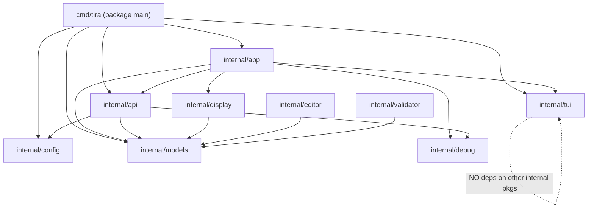
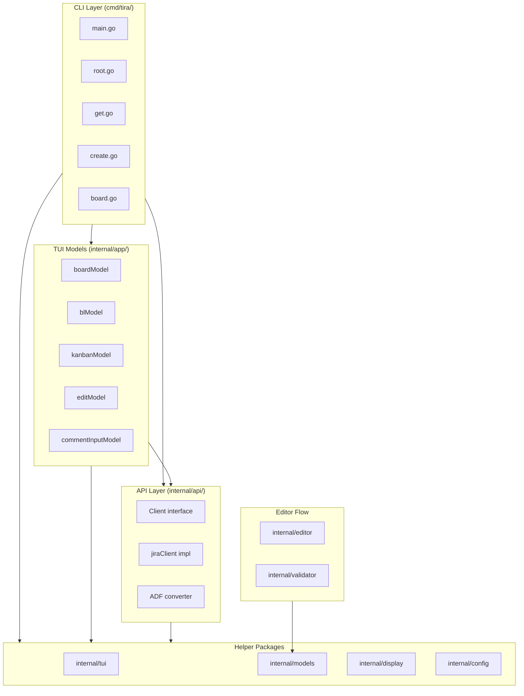

# tira — Architecture

**Last updated:** 2026-03-21

## Overview

tira is a terminal UI for Jira built in Go with the Charm ecosystem (Bubbletea, Bubbles, Lipgloss, Glamour). It provides two interactive views (backlog and kanban) under a unified board TUI, plus CLI commands for fetching, editing, and creating issues via `$EDITOR`.

---

## Project Layout

```
tira/
├── cmd/tira/                  # Thin CLI layer — Cobra commands + config
│   ├── main.go                # Entry point → Execute()
│   ├── root.go                # Cobra root command, --debug flag, config loading
│   ├── board.go               # board/backlog/kanban Cobra commands
│   ├── get.go                 # `get <key> [--edit]` — fetch/display/edit single issue
│   └── create.go              # `create` — new issue via $EDITOR template
│
├── internal/
│   ├── app/                   # All Bubbletea TUI models
│   │   ├── board.go           # boardModel: top-level TUI model
│   │   ├── board_overlays.go  # boardModel overlay rendering
│   │   ├── backlog.go         # blModel: backlog state + update logic
│   │   ├── backlog_view.go    # blModel: all View() rendering
│   │   ├── kanban.go          # kanbanModel: state + update + rendering
│   │   ├── kanban_view.go     # kanbanModel: view helpers
│   │   ├── edit_form.go       # editModel: in-TUI issue form
│   │   ├── edit_cmds.go       # editFormState: tea.Cmd funcs, pickers
│   │   └── comment_form.go    # commentInputModel: in-TUI comment textarea
│   ├── api/
│   │   ├── client.go          # Client interface + jiraClient implementation
│   │   └── adf.go             # Atlassian Document Format → Markdown converter
│   ├── config/
│   │   └── config.go          # Config struct + Load(profileName) using viper
│   ├── models/
│   │   └── models.go          # Shared data types (no logic)
│   ├── tui/
│   │   ├── spinner.go         # Generic RunWithSpinner[T] for pre-TUI blocking ops
│   │   ├── styles.go          # Color constants, shared lipgloss styles, helper funcs
│   │   ├── helpers.go         # FixedWidth, Clamp, SplitPanes, OverlaySize, etc.
│   │   ├── picker.go          # PickerModel: reusable debounced search picker
│   │   └── help.go            # HelpModel: scrollable keybinding overlay
│   ├── display/
│   │   └── issue.go           # RenderIssue: Issue → Markdown string
│   ├── editor/
│   │   ├── template.go        # RenderTemplate + WriteTempFile
│   │   ├── parse.go           # ParseTemplate: template string → IssueFields
│   │   └── open.go            # OpenEditor: exec $EDITOR and block
│   ├── validator/
│   │   ├── validate.go        # Validate: IssueFields + ValidValues → []ValidationError
│   │   └── annotate.go        # AnnotateTemplate: inject error comments into template
│   └── debug/
│       └── logger.go          # File-based debug logger + HTTP transport wrapper
│
├── docs/
│   ├── architecture.md        # This file
│   ├── cli-commands.md        # CLI command details
│   ├── configuration.md       # Configuration system details
│   ├── tui-architecture.md    # TUI model architecture
│   ├── api-client.md          # API client details
│   ├── internal-packages.md   # Internal package details
│   ├── state-machines.md      # State machine diagrams
│   ├── glossary.md            # Glossary and key types
│   ├── keybindings-backlog.md # Keybinding reference
│   ├── go-idioms-review.md    # Code review notes
│   ├── tira-plan.md           # Project plan
│   └── tira-tasks.md          # Task list
├── config.example.yaml
├── go.mod
├── Makefile
├── CLAUDE.md
└── README.md
```

---

## Package Dependency Graph



### Critical Invariants

- **`internal/tui` imports ONLY Charm libraries** — never any other `internal/` package
- **`internal/editor` and `internal/validator` are pure string/struct logic** — no I/O, no TUI
- **`internal/api` does not import `tui`, `display`, `editor`, or `validator`**
- **All TUI model code lives in `internal/app/`** — `cmd/tira/` is a thin CLI layer (Cobra commands + config)

---

## Architecture Overview



---

## TUI Architecture

### Unified Board Model

The board TUI runs a single `tea.Program` wrapping a `boardModel`. It manages:
- Two sub-models: `blModel` (backlog) and `kanbanModel` (kanban)
- Multiple overlay states (edit form, create form, assignee picker, help, comment input)
- Shared data (sprint groups, board columns, issue cache)

**View switching:** `Tab` toggles between backlog and kanban. `1` and `2` switch directly. Data is shared — the backlog's sprint groups and kanban's active sprint are fetched once and shared between views.

**State machine (per sub-view):**

```
blModel:     blList → blFilter (/) → blList
                    → blLoading (enter) → blDetail (esc) → blList

kanbanModel: stateBoard → stateLoading (enter) → stateDetail (esc) → stateBoard
```

### Bubbletea Patterns Used

1. **Async fetch via Cmd**: API calls run in goroutines, results delivered as `tea.Msg`.
2. **Spinner overlay**: `spinner.Model` ticks during loading states.
3. **Viewport scrolling**: Detail pane uses `viewport.Model` for scrollable content.
4. **Text input**: Filter bar uses `textinput.Model`.
5. **Split pane layout**: `tui.SplitPanes()` renders list + detail side-by-side.

### Generic Spinner

`tui.RunWithSpinner[T]` eliminates boilerplate for any blocking operation:

```go
issues, err := tui.RunWithSpinner("Fetching…", func() ([]Issue, error) {
    return client.GetActiveSprint(boardID)
})
```

Uses Go generics to avoid per-type spinner model duplication.

---

## API Client

`api.Client` is an interface with a single implementation (`jiraClient`). This enables testing with mock clients.

```go
type Client interface {
    GetIssue(key string) (*models.Issue, error)
    UpdateIssue(key string, fields models.IssueFields) error
    CreateIssue(projectKey string, fields models.IssueFields) (*models.Issue, error)
    GetValidValues(projectKey string) (*models.ValidValues, error)
    GetBoardColumns(boardID int) ([]models.BoardColumn, error)
    GetActiveSprint(boardID int) ([]models.Issue, error)
    GetSprintGroups(boardID int) ([]models.SprintGroup, error)
    GetSprintList(boardID int) ([]models.Sprint, error)
    GetSprintGroupsBatch(boardID int, sprints []models.Sprint) ([]models.SprintGroup, error)
    GetBacklogIssues(boardID int) ([]models.Issue, error)
    MoveIssuesToSprint(sprintID int, keys []string) error
    MoveIssuesToBacklog(keys []string) error
    // ... and more
}
```

**Hybrid approach:** Uses `go-jira` for structured fields, raw HTTP for ADF (Atlassian Document Format) fields that go-jira can't decode. Sprint group fetches run concurrently with `sync.WaitGroup`. The board TUI uses progressive loading: first 3 sprints are fetched initially, remaining sprints + backlog are lazy-loaded after the TUI renders.

### API Client Conventions

For Jira API endpoints not natively supported by the go-jira library, use `c.client.NewRequest` and `c.client.Do` instead of raw `http.Client` requests:

```go
req, err := c.client.NewRequest(ctx, http.MethodPut, "rest/agile/1.0/issue/rank", payload)
if err != nil { return err }
_, err = c.client.Do(req, nil)
return err
```

`NewRequest` handles JSON encoding and base URL resolution; `Do` handles response checking.

---

## Editor Flow

The `get --edit` and `create` commands share the same template-based editing loop:

```
RenderTemplate() → WriteTempFile() → OpenEditor() → ReadFile()
    → ParseTemplate() → Validate() → [errors? AnnotateTemplate() → loop]
    → ResolveAssigneeID() → UpdateIssue/CreateIssue
```

- **Template format**: YAML-like front matter + markdown body, separated by `---`
- **Sentinel line**: `<!-- tira: ... -->` detects template corruption
- **Validation loop**: Errors annotated inline, user can fix and re-save
- **Pure functions**: `ParseTemplate()` and `Validate()` take strings/structs, return values — no I/O.

---

## Configuration

Stateless, config file-based:

**Config file location:** `~/.config/tira/config.yaml`

```yaml
profiles:
  default:
    jira_url: https://yourorg.atlassian.net
    email: you@example.com
    token: your_token_here
    project: MP
    board_id: 42
    classic_project: true
```

**Global flags:**
- `--profile <name>` (default: `"default"`) — selects which profile to use
- `--debug` — enables file-based debug logging to `./debug.log`

See [Configuration](configuration.md) for details.

---

## Shared TUI Infrastructure (`internal/tui`)

| File | Purpose |
|------|---------|
| `spinner.go` | `RunWithSpinner[T]` — generic async spinner for any blocking operation |
| `styles.go` | Color constants (`ColorRed`, `ColorBlue`, etc.), shared styles (`DimStyle`, `BoldBlue`), `IssueTypeColor()`, `EpicColor()` |
| `helpers.go` | `FixedWidth`, `Clamp`, `SplitPanes`, `ListPaneWidth`, `DetailPaneWidth`, `ContainsCI` |
| `picker.go` | `PickerModel` — reusable debounced search picker |
| `help.go` | `HelpModel` — scrollable keybinding overlay |

**Design constraint:** This package has **no dependencies** on other internal packages. It only imports Charm libraries. This keeps it reusable and prevents circular dependencies.

---

## Code Conventions

### Color Constants

Use `internal/tui` color constants (e.g. `tui.ColorAccent`) instead of raw string literals like `"12"`:

```go
// Good
style := lipgloss.NewStyle().Foreground(tui.ColorAccent)

// Bad
style := lipgloss.NewStyle().Foreground("12")
```

### Spinner Usage

Use `tui.RunWithSpinner[T]` for any blocking operation that needs a loading indicator — do not create one-off spinner models:

```go
// Good
issue, err := tui.RunWithSpinner("Fetching issue...", func() (*models.Issue, error) {
    return client.GetIssue(key)
})

// Bad
spinner := spinner.New()
spinner.Spinner = spinner.Dot
// ... manual spinner management
```

### TUI Helpers

Use `tui.FixedWidth`, `tui.Clamp`, `tui.SplitPanes` and other helpers from `internal/tui/helpers.go` instead of reimplementing:

```go
// Good
keyCol := tui.FixedWidth(issue.Key, 10)

// Bad
keyCol := fmt.Sprintf("%-10s", issue.Key)
```

### File Organization

- Backlog rendering is split: `backlog.go` (model + update) and `backlog_view.go` (rendering)
- Kanban similarly split: `kanban.go` (model + update) and `kanban_view.go` (rendering)
- Edit form split: `edit_form.go` (model) and `edit_cmds.go` (commands)

---

## Keybindings

Any new keybindings should be updated in:
- [Keybindings reference](keybindings-backlog.md)
- [Help window](internal/tui/help.go) (optional)
- Bottom persistent help (optional)

---

## Build & Quality

```sh
make build        # compile the binary
make test         # run all tests
make test-race    # run tests with race detector
make fmt          # format code in-place
make fmt-check    # check formatting without modifying files
make vet          # run go vet
make lint         # run golangci-lint
make check        # run all checks (fmt, vet, lint, test)
```

Always run `make check` before pushing.

---

## Documentation

| Document | Description |
|----------|-------------|
| [CLI Commands](cli-commands.md) | Detailed CLI command documentation |
| [Configuration](configuration.md) | Configuration system details |
| [TUI Architecture](tui-architecture.md) | TUI model architecture and patterns |
| [API Client](api-client.md) | API client implementation details |
| [Internal Packages](internal-packages.md) | Internal package documentation |
| [State Machines](state-machines.md) | State machine diagrams |
| [Glossary](glossary.md) | Glossary and key types |
| [Keybindings](keybindings-backlog.md) | Complete keybinding reference |

---

## See Also

- [Go Idioms Review](go-idioms-review.md) — Code quality review notes
- [Project Plan](tira-plan.md) — Original project plan
- [Tasks](tira-tasks.md) — Task tracking
