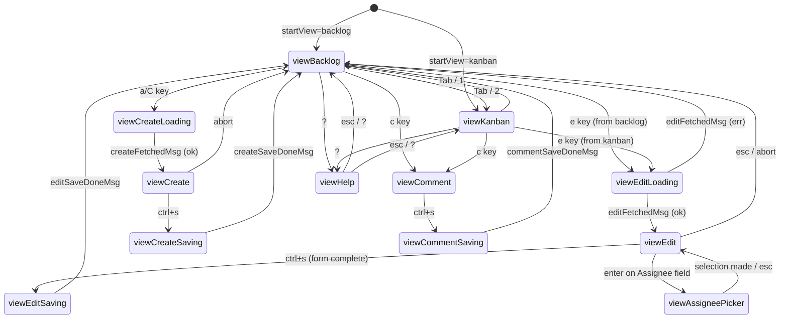
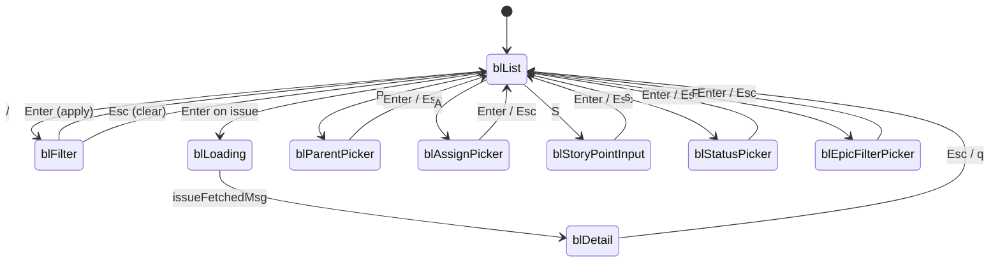
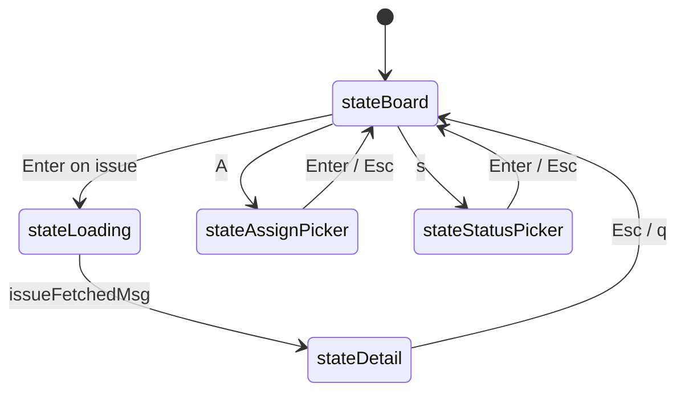
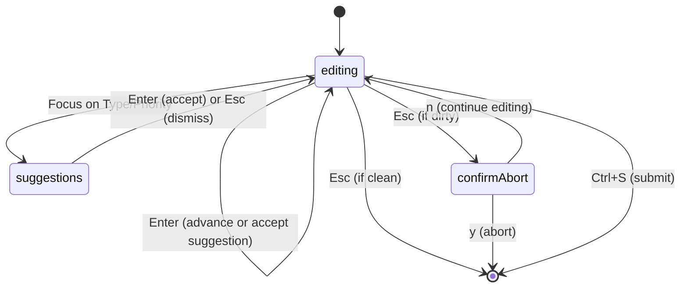
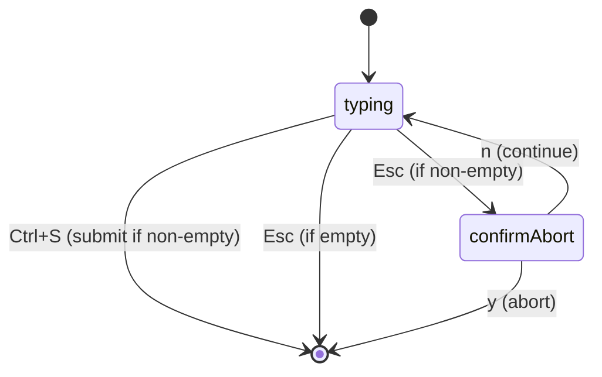

# State Machines

This document describes the state machines used throughout the tira TUI.

---

## boardModel View States

The top-level board TUI state machine manages view switching and overlay states.



### State Descriptions

| State | Description |
|-------|-------------|
| `viewBacklog` | Backlog view active (base state) |
| `viewKanban` | Kanban view active (base state) |
| `viewEditLoading` | Fetching issue + valid values for edit |
| `viewEdit` | Edit form active (huh-like multi-field input) |
| `viewEditSaving` | API call to update issue in flight |
| `viewCreateLoading` | Fetching valid values for new issue |
| `viewCreate` | Create form active |
| `viewCreateSaving` | API call to create issue in flight |
| `viewAssigneePicker` | Assignee fuzzy picker overlay |
| `viewHelp` | Help overlay active |
| `viewComment` | Comment textarea active |
| `viewCommentSaving` | API call to add comment in flight |

### View Switching Rules

View switching (Tab, 1, 2) is **gated** by `canSwitchView()`:

- Returns `true` only when the active sub-model is in its base navigation state
- Blocked when: filter active, detail view open, visual mode active

---

## blModel (Backlog) States

The backlog view state machine handles navigation, filtering, and detail operations.



### State Descriptions

| State | Description |
|-------|-------------|
| `blList` | Normal list navigation (base state) |
| `blFilter` | Filter mode active (`/` key) |
| `blLoading` | Fetching issue for detail view |
| `blDetail` | Issue detail pane open |
| `blParentPicker` | Parent/epic picker overlay |
| `blAssignPicker` | Assignee picker overlay |
| `blStoryPointInput` | Story points inline input |
| `blStatusPicker` | Status transition picker |
| `blEpicFilterPicker` | Epic filter picker |

---

## kanbanModel (Kanban) States

The kanban view state machine handles column navigation and detail operations.



### State Descriptions

| State | Description |
|-------|-------------|
| `stateBoard` | Column navigation (base state) |
| `stateLoading` | Fetching issue for detail view |
| `stateDetail` | Issue detail pane open (viewport) |
| `stateAssignPicker` | Assignee picker overlay |
| `stateStatusPicker` | Status transition picker |

---

## editModel (Edit Form) States

The in-TUI edit form state machine handles field navigation and submission.



### State Descriptions

| State | Description |
|-------|-------------|
| `editing` | Normal form editing (base state) |
| `suggestions` | Inline suggestions panel visible |
| `confirmAbort` | Dirty-check confirmation prompt |

---

## commentInputModel States

The comment input state machine is simple:



---

## State Transitions via Result Structs

Sub-models signal cross-boundary actions via `result` structs. After delegating `Update`, `boardModel` checks these and transitions accordingly.

### blResult

```go
type blResult struct {
    editKey      string  // Open edit form
    commentKey   string  // Open comment input
    wantRefresh  bool    // Refresh board data
    moveMulti    struct{...}  // Move issues operation
    // ...
}
```

### kanbanResult

```go
type kanbanResult struct {
    editKey      string  // Open edit form
    commentKey   string  // Open comment input
    // ...
}
```

---

## Concurrency States

### Async Operations

All API calls inside the TUI are wrapped as `tea.Cmd` functions that run in goroutines:

```go
func fetchIssueCmd(client api.Client, key string, vpW int) tea.Cmd {
    return func() tea.Msg {
        // runs in goroutine
        issue, err := client.GetIssue(key)
        return issueFetchedMsg{issue: issue, err: err}
    }
}
```

### Message Types

| Message | Trigger |
|---------|---------|
| `issueFetchedMsg` | Issue fetch complete |
| `editFetchedMsg` | Edit data fetch complete |
| `createFetchedMsg` | Create data fetch complete |
| `editSaveDoneMsg` | Edit save complete |
| `createSaveDoneMsg` | Create save complete |
| `commentSaveDoneMsg` | Comment save complete |
| `boardRefreshDoneMsg` | Board refresh complete |
| `blMoveMultiDoneMsg` | Multi-move operation complete |
| `blRankDoneMsg` | Rank operation complete |

---

## See Also

- [TUI Architecture](tui-architecture.md) — Detailed model descriptions
- [Keybindings](keybindings-backlog.md) — Keys that trigger state transitions
